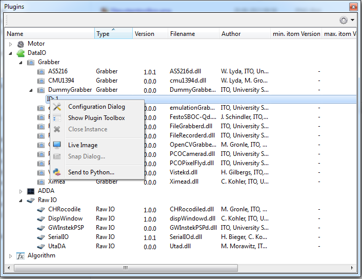
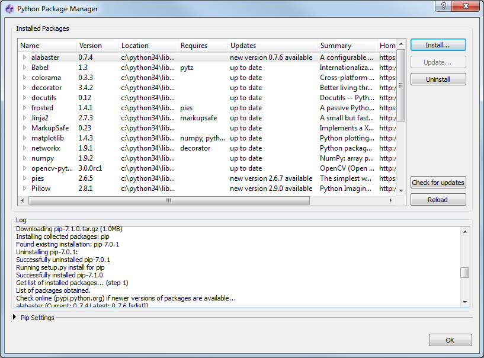
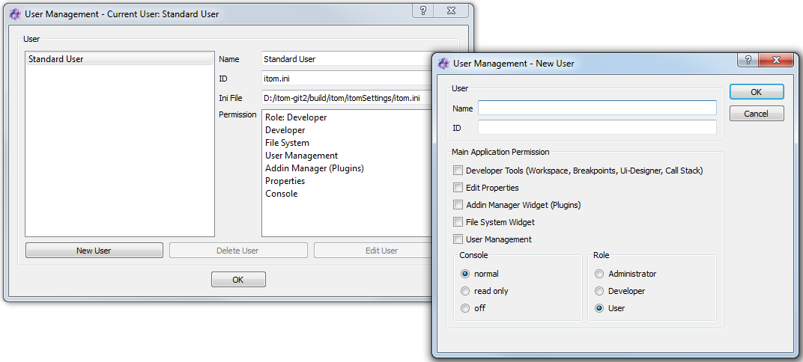
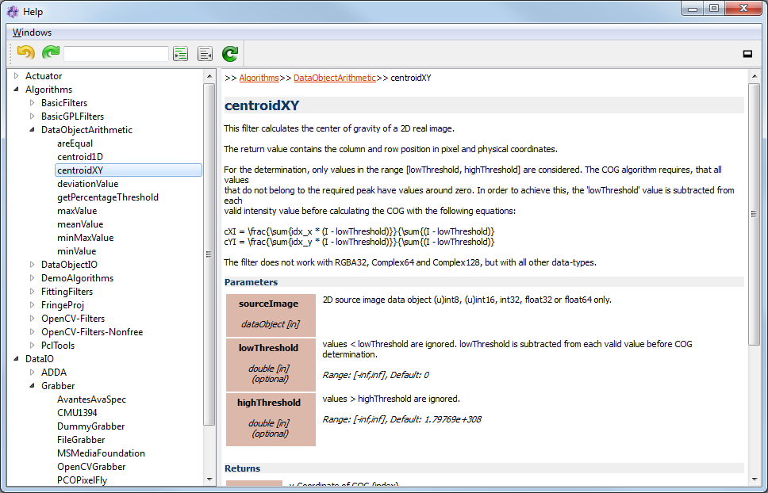
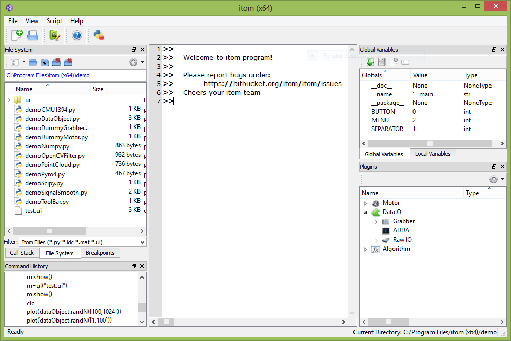
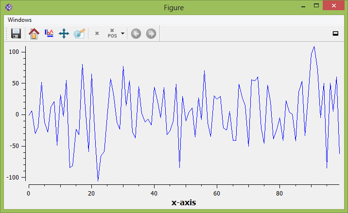
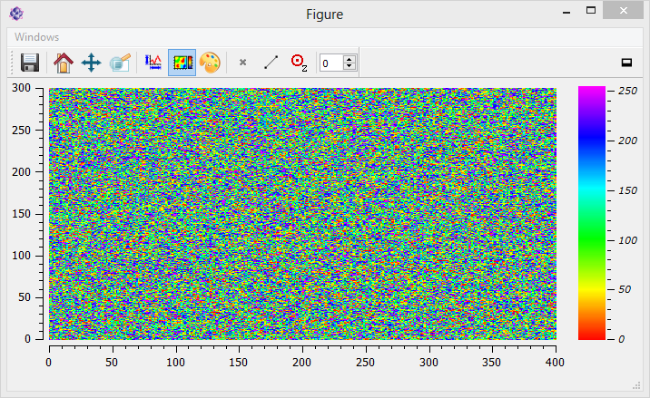

.. _sec-screenshots:

Screenshots
=============

The following screenshots give you an overview about **itom**.

**Windows 7 Screenshots**

   
   Main window of **itom** with docked 2D false-color image of a loaded dataObject

   
   Script editor with debugging functionality

.. figure:: _static/screenshots/win7/itom2dqwtplot.png
   :width: 75%
   :align: center
   :alt: 2D plot
   
   2D plot (*itom2dqwtplot*) with optional property toolbox

   
   plugin toolbox for all detected hardware and algorithm plugins

.. figure:: _static/screenshots/win7/filesystemtoolbox.png
   :width: 50%
   :align: center
   :alt: file system toolbox
   
   toolbox with file system to easily get access to script files and other loadable files (e.g. images...)

   
   toolbox with access to global and local workspace (python variables)

.. figure:: _static/screenshots/win7/qtDesigner.png
   :width: 75%
   :align: center
   :alt: Qt Designer
   
   Qt Designer to easily design user defined windows and dialogs that can be opened at runtime of *itom*

   
   plots and other designer widgets that come with *itom* can be integrated in user defined windows and dialogs
   

   
   The Python Package Manager helps to install and upgrade Python packages from remote servers or whl-files.
   

   
   A user management allows starting itom with different settings and  configurations.
   

   
   The script documentation window informs about descriptions and parameters of algorithms and plugins and can optionally display a syntax help for different python modules (e.g. itom module)

**Windows 8 Screenshots**

   
   Main window of **itom**

.. figure:: _static/screenshots/win8/dialogProperties.png
   :width: 75%
   :align: center
   :alt: property dialog
   
   Property dialog for important system properties

   
   Dialog that informs about the load status of any plugins. Warnings and errors about version conflicts or missing 3rd party modules are displayed.

   
   Script editor with syntax highlighting

   
   1D line plot

   
   2D plot with chosen color map and color bar.
   
   
**Debian (KDE) Screenshots**

.. figure:: _static/screenshots/debian/itom.png
   :width: 75%
   :align: center
   :alt: itom main window
   
   Main window of **itom**